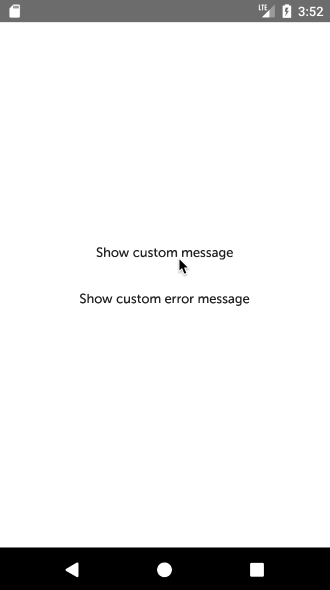

# react-native-messages

React Native notification-like messages


## Features
- Customizable message component
- Fast native driver animations
- Auto-hide current message to display a next one
- Robust implementation, used in production code

Messages are not interactable in any way

## Installation
```
$ npm install react-native-messages
```

## Usage
1. Add `<MessageBar/>` to the top of your view hierarchy, as a last component. If you are using `react-navigation`, root navigator should be in place of `<App/>`. Root view should have `flex: 1`:
```jsx
import { MessageBar } from 'react-native-messages';

<View style={{ flex: 1 }}>
  <App/>
  <MessageBar/>
<View>
```

2. Call `showMessage` in any other component:
```jsx
import { showMessage } from 'react-native-messages';

<Button onPress={() => showMessage('You are awesome!')}/>
```

## Config
Prop                  | Type      | Default              
----------------------|-----------|--------------------------
messageComponent      | Component | Default message component
duration              | Number    | 1000
slideAnimationOffset  | Number    | 40
showAnimationDuration | Number    | 255
hideAnimationDuration | Number    | 255
closeOnSwipe          | Boolean   | true

You can add custom config as a second argument to `showMessage` call to configure individual messages. E.g. `showMessage('You are awesome!', { duration: 3000 })`.

## Custom message component
Default message will receive only string, but you can implement your own message component to work with any other objects e.g Error instances:

```jsx
function Message({ message }) {
  if (message instanceof Error) {
    // return error-styled message
  } else {
    // return normal message
  }
}

<MessageBar messageComponent={Message}/>

<Button onPress={() => showMessage(new Error('Boom!'))}/>
```



## Demo

```
$ git clone git@github.com:Qlean/react-native-messages.git
$ cd react-native-messages/demo
$ npm install
$ npm start
$ react-native run-android # assuming Android emulator is running: https://facebook.github.io/react-native/docs/getting-started.html#installing-dependencies
```

## Contributing

Same as demo. Run `npm install` in root directory to install ESLint.
